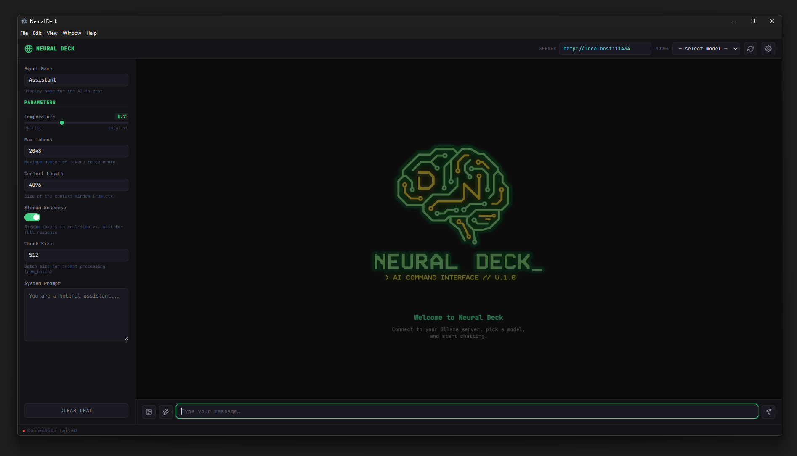

# Neural Deck

A sleek Electron desktop client for [Ollama](https://ollama.com) with a Linux terminal–inspired UI.




## Features

- **Streaming chat** — real-time token streaming with stop/cancel support
- **Vision model detection** — 👁 icon in the model dropdown for models with image capabilities
- **Image & file attachments** — attach images (base64 for vision models) or text files to your prompts; attached files display as chips in the chat history
- **Emoji picker** — built-in emoji panel with 8 categorized tabs and search
- **Persistent chat history** — choose between in-memory or disk-based history storage
- **Encrypted history** — optional AES-256-GCM encryption for disk-stored conversations
- **Performance stats** — tokens/sec and token count displayed on every response
- **Configurable parameters** — temperature, max tokens, context length, chunk size, system prompt
- **Agent naming** — customize the assistant's display name
- **Auto-persistence** — all settings saved automatically to a local config file
- **Terminal aesthetic** — monospace font, green accent, scanline overlay, dark theme

## Prerequisites

- [Node.js](https://nodejs.org) 18+
- [Ollama](https://ollama.com) running locally (or on a reachable server)

## Quick Start

```bash
# Clone / copy the project
git clone <repo-url> neural-deck
cd neural-deck

# Install dependencies
npm install

# Launch
npm start
```

The app will auto-connect to `http://localhost:11434` and fetch available models on startup.

## Usage

1. **Connect** — enter your Ollama server URL in the top bar and click the refresh button
2. **Select a model** — pick from the dropdown (👁 = vision-capable)
3. **Chat** — type a message and press Enter or click Send
4. **Attach files** — use the 📷 (image) or 📎 (file) buttons next to the input
5. **Emoji** — click the 😊 smiley button to open the emoji picker; click any emoji to insert it at your cursor
6. **Tune parameters** — open the settings sidebar with the gear icon

### Keyboard Shortcuts

| Key | Action |
|-----|--------|
| `Enter` | Send message |
| `Shift+Enter` | New line in input |
| `Escape` | Close emoji picker / encryption key modal |

## Chat History

Neural Deck supports two history storage modes, configurable in the Settings sidebar under **History**:

### Memory (default)

Chat history lives only in the current session. Closing the app loses all conversation data.

### Disk

Chat history is written to `chat_history/current.json` in the app directory after every message. On restart, your conversation is automatically restored.

### Encrypted Disk

When the **Encrypt History** toggle is enabled (only visible in Disk mode), chat history is encrypted with **AES-256-GCM** before being saved to `chat_history/current.enc`.

- **Key derivation** — your passphrase is run through `scryptSync` with a random 16-byte salt to derive a 256-bit key
- **Encryption** — each save generates a fresh 12-byte IV; the file format is `salt(16) + iv(12) + authTag(16) + ciphertext`
- **Key prompt** — a modal overlay prompts for your passphrase when encryption is first used and again on each app restart. The passphrase is held only in memory and never written to disk
- **Wrong passphrase** — GCM's authentication tag detects incorrect keys and shows an error toast

> **Note:** The `chat_history/` directory is listed in `.gitignore` to prevent accidental commits of conversation data.

## Project Structure

```
neural-deck/
├── main.js          # Electron main process (window, IPC, file dialogs, crypto)
├── preload.js       # Bridge between main & renderer (Ollama API, history IPC)
├── renderer.js      # Frontend logic (chat, markdown, attachments, emoji, history)
├── index.html       # App layout & structure
├── styles.css       # Terminal-themed styling
├── ndlogo.png       # App logo
├── .gitignore       # Excludes node_modules/ and chat_history/
├── chat_history/    # Auto-created; stores persisted conversations
└── package.json
```

## Configuration

Settings are auto-saved to `<userData>/config.json` and restored on launch:

| Setting | Default | Description |
|---------|---------|-------------|
| Server URL | `http://localhost:11434` | Ollama API endpoint |
| Temperature | `0.7` | Sampling temperature (0 = precise, 2 = creative) |
| Max Tokens | `2048` | Maximum tokens to generate |
| Context Length | `4096` | Context window size (`num_ctx`) |
| Chunk Size | `512` | Prompt batch size (`num_batch`) |
| Stream | `true` | Stream tokens in real-time |
| Agent Name | `Assistant` | Display name for the AI |
| System Prompt | *(empty)* | System message prepended to conversations |
| History Mode | `memory` | `memory` or `disk` |
| Encrypt History | `false` | Enable AES-256-GCM encryption for disk history |

## API

The client communicates with Ollama via its REST API:

- `GET /api/tags` — list models (with vision detection via `details.families`)
- `POST /api/chat` — chat completion (streaming or non-streaming)

## Security

- Encryption uses **AES-256-GCM** — an authenticated encryption scheme that provides both confidentiality and integrity
- Key derivation uses **scrypt** (`N=16384, r=8, p=1`) with a unique random salt per save
- The passphrase is **never persisted** — it's held only in a JavaScript variable for the duration of the session
- The encryption key modal is **separate from the chat** — passphrase input is never added to chat history or sent to the model

## License

MIT
